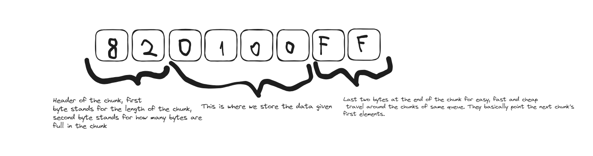
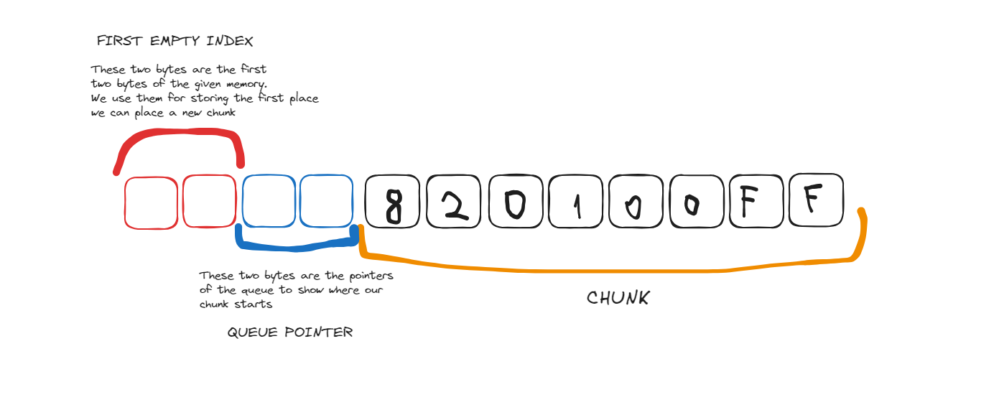
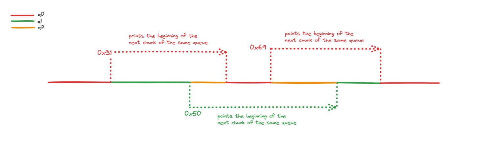

# efficient-queue
Efficien't queue implementation in C++

The problem given:

> The problem is to write a set of functions to manage a variable number of byte
> queues, each with variable length, in a small, fixed amount of memory. You
> should provide implementations of the following four function
> 
     Q *create_queue(); // Creates a FIFO byte queue, returning a handle to it.
     void destroy_queue(Q *q); // Destroy an earlier created byte queue.
     void enqueue_byte(Q *q, unsigned char b); // Adds a new byte to a queue.
     unsigned char dequeue_byte(Q *q); // Pops the next byte off the FIFO queue.
> 
> So, the output from the following set of calls:
> 
     Q *q0 = create_queue();
     enqueue_byte(q0, 0);
     enqueue_byte(q0, 1);
     Q *q1 = create_queue();
     enqueue_byte(q1, 3);
     enqueue_byte(q0, 2);
     enqueue_byte(q1, 4);
     printf("%d", dequeue_byte(q0));
     printf("%d\n", dequeue_byte(q0));
     enqueue_byte(q0, 5);
     enqueue_byte(q1, 6);
     printf("%d", dequeue_byte(q0));
     printf("%d\n", dequeue_byte(q0));
     destroy_queue(q0);
     printf("%d", dequeue_byte(q1));
     printf("%d", dequeue_byte(q1));
     printf("%d\n", dequeue_byte(q1));
     destroy_queue(q1);
> 
> should be:
> 
>     0 1
>     2 5
>     3 4 6
> 
> You can define the type Q to be whatever you want.
> 
> Your code is not allowed to call malloc() or other heap management routines.
> Instead, all storage (other than local variables in your functions) must be
> within a provided array:
> 
    unsigned char data[2048];
> 
> Memory efficiency is important. On average while your system is running, there
> will be about 15 queues with an average of 80 or so bytes in each queue. Your
> functions may be asked to create a larger number of queues with less bytes in
> each. Your functions may be asked to create a smaller number of queues with more
> bytes in each.
> 
> Execution speed is important. Worst-case performance when adding and removing
> bytes is more important than average-case performance.
> 
> If you are unable to satisfy a request due to lack of memory, your code should
> call a provided failure function, which will not return:
> 
    void on_out_of_memory();
> 
> If the caller makes an illegal request, like attempting to dequeue a byte from
> an empty queue, your code should call a provided failure function, which will
> not return:
> 
    void on_illegal_operation();
> 
> There may be spikes in the number of queues allocated, or in the size of an
> individual queue. Your code should not assume a maximum number of bytes in a
> queue (other than that imposed by the total amount of memory available, of
> course!) You can assume that no more than 64 queues will be created at once.
> 
**LET'S TAKE A LOOK AT THE ALGORITHM**

At first look, I thought array(unsigned char data[2048]) was for each queue, but after finishing the code, I realized that given array was the whole memory we should use. So I deleted all the code inside the functions and started with a new algorithm:

I decided to use chunks of data and some pointers within each chunk. Using chunks was a good idea because I could link them without needing them to be together at the close places in the memory and I wouldn't need to delete the queue pointers since I will be pointing them outside of the chunks. Also, another reason to use chunk is, I can easily manipulate the chunks to add/delete data without having a limited memory problem. At the end, my structure for chunks was like:

But there were still some data I needed to know, like where is the first available place I can place my new chunk, and where my chunk starts. Also I should make them outside of the chunk itself so if my chunk got deleted, I wouldn't lose them. Let me show you the new style of the structure I made:

As you can see in the images, I mostly use 2 bytes for the location showing pointers, thats because we have 2048 bytes of space and one byte can hold maximum of 256 values(2^8) so we use 2 bytes to make it reach till the end of the memory(256*256). We use reinterpret_cast<uint16_t *> to trick c++ into read two bytes in one value. 

I also would like to show how I traverse around the chunks of a queue.

As you can see in the image, last two bytes of the chunk is reserved to traverse to the first bytes of the next chunk.

**REGARDING EXECUTION SPEED**

>"Execution speed is important. Worst-case performance when adding and removing
> bytes is more important than average-case performance."

This was one of the real challenges in the project. Even though I can't say my code is the most efficient version of all, I can proudly say I tried my best to write it in an efficient way as my experience let me. When I first started thinking about execution speed therefore efficiency of the code I had to trash all the ideas with shifting the bytes in the memory (definitely not efficient to shift 2000 bytes for placing one byte:D). After a quick research and hours of debate with other engineer friends, I decided the best way I could do is using chunks with a small amount of empty space and definitely avoid the use of shifting the bytes. Also existence of pointers in c++ (even though they're little mischiefs of the language) helped a lot as well in terms of efficiency. I also would like to mention a website which had the solution of the exact same problem, I got lots of inspiration from this blog post so I would like to give them the credits : https://progtools.org/article.php?name=queue&section=compilers&type=tutorial

**POTENTIAL IMPROVEMENTS**

* I think we all realize that this code is not the best solution in terms of efficiency (that's why its efficien't).  
* Probably there are safety issues/potential bugs in the code itself since I play with dangerous stuff(interpret casts, pointers etc.) To solve this we could use a memory safe language / static analyses tools. 